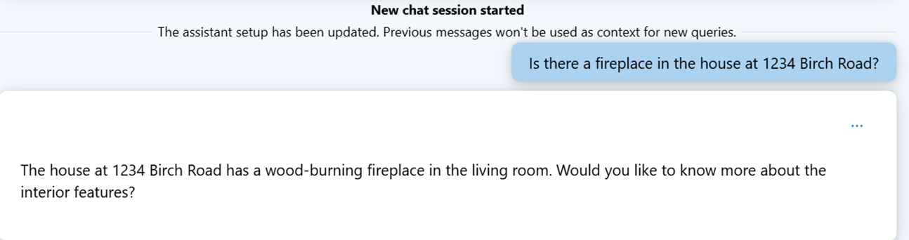
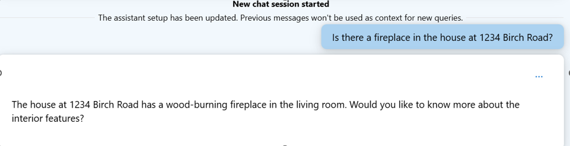
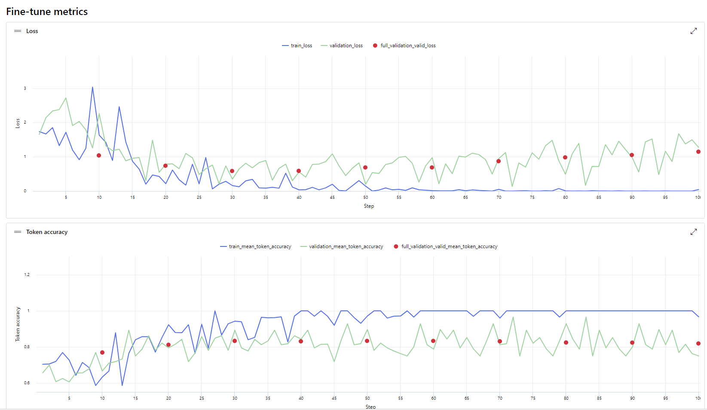

# Real Estate Use Case: Fine-Tuning a GPT-4o mini


## Overview

This project repository showcases the process of fine-tuning GPT-4o mini for a real estate use case. The fine-tuned model is tailored to help real estate agents quickly and accurately search for property information, delivering concise and relevant responses to their queries. While many use cases can be addressed through prompt engineering, which is generally more straightforward and cost-effective, there are distinct advantages to fine-tuning that I would like to emphasize. Below, I outline these benefits and discuss their impact on the real estate industry.


### Importance of Fine-Tuning Small Language Models (SLMs) for Industry-Specific Use Cases

Fine-tuning small language models (SLMs) can be crucial for building industry-specific models due to several key reasons:

- #### Customization for Domain-Specific Language:
   - Enhanced Understanding: Fine-tuning allows SLMs to grasp the unique terminology, phrases, and jargon specific to an industry. This customization ensures the model can communicate effectively within its target domain.
   - Contextual Relevance: By training the model on industry-specific data, it can better understand the context and nuances of conversations, leading to more accurate and relevant responses tailored to the industry’s needs.

- #### Efficiency and Cost-Effectiveness:
   - Resource Optimization: Fine-tuning enables the model to be trained on a smaller dataset, which is more resource-efficient in terms of computational power and time. This makes it a cost-effective solution for businesses looking to deploy specialized AI tools.
   - Targeted Applications: Fine-tuned SLMs can focus on specific tasks within an industry, making them highly effective for niche applications without the need for large-scale models.

- #### Improved User Experience:
   - Refined Interactions: Fine-tuning allows the model to adapt its conversational style and tone to better suit the target audience, enhancing user engagement and satisfaction.
   - Enhanced Decision-Making: With fine-tuning, the model can provide more accurate and context-aware suggestions or decisions, improving the overall user experience in industry-specific scenarios.

- #### Data Privacy and Compliance:
   - On-Premise Deployment: Fine-tuned SLMs can be deployed on-premises, ensuring that sensitive industry data remains secure and private, which is particularly important in sectors like finance, healthcare, and legal.
   - Regulatory Adherence: The model can be fine-tuned to adhere to specific legal and regulatory requirements of the industry, reducing the risk of non-compliance.

- #### Scalability and Flexibility:
   - Gradual Expansion: Fine-tuning SLMs allows businesses to start with a focused, small-scale application and scale up as needed, adding more features or transitioning to larger models if required.

Fine-tuning SLMs enables the creation of highly specialized, efficient, and effective industry-specific models, leading to better performance, cost savings, and a superior user experience.

### Benefits of fine-tuning GPT-4o mini for real estate use cases

Fine-tuning GPT-40 mini for a real estate use case, such as searching properties with a chatbot, can provide several benefits:

1. #### Customization for Domain-Specific Language
    - Real Estate Terminology: Fine-tuning allows the model to better understand and use the specific terminology, phrases, and jargon common in real estate, such as "cap rate," "escrow," "comparables," or "closing costs."
    - Contextual Understanding: The model can be trained to better grasp the context and nuances specific to real estate conversations, ensuring it provides more accurate and relevant responses.

2. #### Improved Search Relevance
    - Enhanced Property Matching: By fine-tuning, the model can learn to prioritize and weigh different property features (e.g., location, square footage, price) based on user preferences, leading to more accurate and personalized property recommendations.
    -  Fine-tuning involves training the model on datasets that include complex, multi-faceted queries typical of real estate interactions.
    -  These datasets might include queries like "Find me a 3-bedroom house in a quiet neighborhood with a good school district and within a 30-minute commute to downtown." By being exposed to such examples during training, the model learns to parse and understand each component of a complex query.

3. #### Better Interaction and User Experience
    - Refined Conversational Style: Fine-tuning can adapt the model's conversational tone and style to better align with the target audience, whether they are first-time homebuyers, seasoned investors, or luxury property seekers.
    - Handling Objections and Queries: The chatbot can be trained to handle common objections or detailed inquiries about properties, financing options, or market conditions more effectively.

4. #### Integration with Proprietary Data
    - Leveraging Internal Data: Fine-tuning can allow the model to better utilize proprietary data, such as a real estate agency’s internal listings, customer preferences, and historical transaction data, to provide more informed and context-aware recommendations.
    - Localized Knowledge: If your real estate business operates in a specific geographic area, fine-tuning can help the model become more knowledgeable about local market conditions, regulations, and trends.

5. #### Enhanced Lead Qualification
    - Prioritizing Leads: The chatbot can be fine-tuned to identify and prioritize high-quality leads based on their interactions and queries, helping sales teams focus on the most promising prospects.
    - Guiding Through the Sales Funnel: Fine-tuning allows the chatbot to better guide users through the sales funnel, from initial inquiry to scheduling a viewing or connecting with an agent.
    - Fine-tuning allows the chatbot to understand and predict the typical steps a user takes in their journey from inquiry to purchase. It can tailor responses based on where the user is in the sales funnel—whether they’re just browsing, comparing options, or ready to make a decision.
    - For example, if a user asks about mortgage rates after inquiring about a property, the chatbot can recognize this as a sign of deeper interest and offer to connect the user with a financial advisor or schedule a viewing.

6. #### Consistency and Accuracy
    - Ensuring Regulatory Compliance: Fine-tuning can help the model consistently adhere to legal and regulatory requirements in real estate, such as fair housing laws, by incorporating specific rules and guidelines into its responses.
    - Reducing Error Rates: Fine-tuning minimizes the likelihood of errors or irrelevant responses, particularly in scenarios where precise information is crucial, such as financing details or contract terms.
  
   #### Scenario: Fair Housing Laws
   Imagine you are building a chatbot for a real estate platform. It is crucial that the chatbot complies with fair housing laws, which prohibit discriminatory practices based on race, color, religion, sex, familial status, national origin, or disability.

   #### How Fine-Tuning Helps:

   Incorporating Specific Rules: During the fine-tuning process, you can train the model on data that includes legally compliant language and excludes any discriminatory phrasing. For instance, instead of suggesting properties based on “preferred neighborhoods” (which    could imply discrimination), the model is trained to focus on objective criteria like price range, square footage, and proximity to amenities.
   Example:

   ##### Before Fine-Tuning: A generic model might respond to a user query like, “Find me a property in a good neighborhood” with suggestions that inadvertently imply bias, such as "This area is known for being predominantly [demographic]."
   ##### After Fine-Tuning: The fine-tuned model responds by focusing on neutral, compliant criteria: “Here are properties within your budget that are close to top-rated schools and have low crime rates.”

By fine-tuning GPT-40 mini for your specific real estate use case, you can create a more tailored, efficient, and user-friendly chatbot experience that not only meets but exceeds the expectations of your customers.


## Before Fine-Tuning



## After Fine-Tuning


### Repository Contents

- **notebooks/**
   - `fine_tuning.ipynb`: The Jupyter Notebook demonstrating the fine-tuning process.
- **data/**
   - `training_data.jsonl`: Training data in JSONL format.
   - `validation_data.jsonl`: Validation data in JSONL format.
- **images/**
   - `house.png`: Visualization of the fine-tuning process.

### Getting Started

1. **Clone the repository:**
    ```bash
    git clone https://github.com/anuragsirish/GPT4o-mini-fine-tuning.git
    ```
2. **Navigate to the directory:**
    ```bash
    cd real-estate-fine-tuning
    ```
    ```
3. **Open the Jupyter Notebook:**
    ```bash
    jupyter notebook notebooks/fine_tuning.ipynb
    ```

### Fine-Tuning Process

The Jupyter Notebook guides you through the following steps:

- Loading and preparing your data.
- Fine-tuning the model using the real estate dataset.
- Deploying the fine-tuned model on Azure AI
- Testing the models

### Evaluation Metrics on AI Studio 





### How pricing works in fine-tuning on Azure AI? 

It is based on the tokens billed. 

Count the number of tokens in your file, multiply that by the per token price, and the number of epochs and you’ve got a decent estimate for the overall costs.

Note: the raw token count for your file may be higher than the actual token counts you’ll be charged for, so this is an estimate, not the actual value you will be billed

https://techcommunity.microsoft.com/t5/ai-azure-ai-services-blog/pricing-update-token-based-billing-for-fine-tuning-training/ba-p/4164465


### License

This project is licensed under the MIT License - see the [LICENSE](LICENSE) file for details.

### Contributing

Contributions are welcome! Please submit a pull request or open an issue to discuss improvements or additions.

### Contact

For any questions or suggestions, feel free to reach out to me at [anurag.karuparti@gmail.com]
